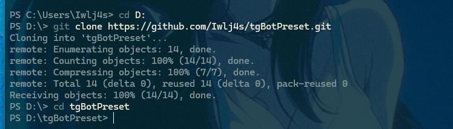
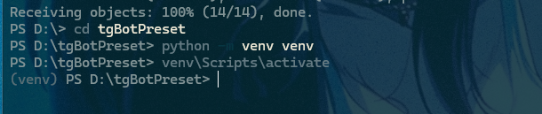
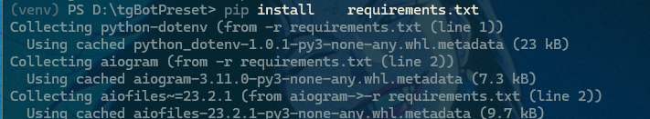
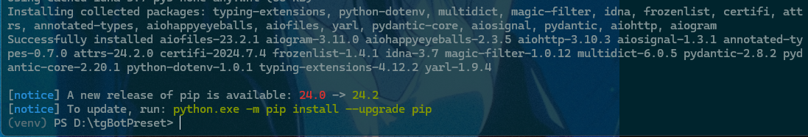
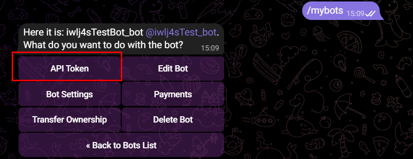
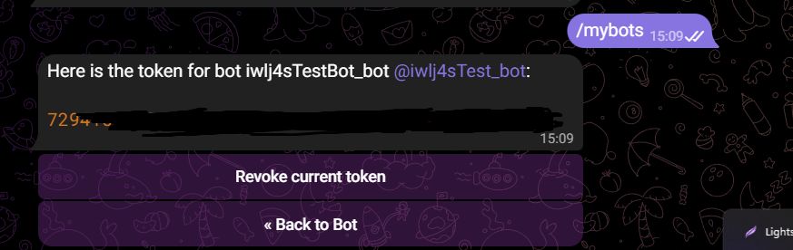
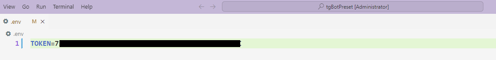

# Telegram Bot Preset

This project is a preset for creating bots in Telegram with using [Aiogram](https://docs.aiogram.dev/en/latest/).

## Project Structure

- `main.py`: Main file for start bot
- `handlers/user_handler.py`: user command handler
- `handlers/admin_handler.py`: admin command handler
- `data/`: For data stuff, like `get_data.py` or something like that
- `bot_commands/bot_commands_list.py`: Commands list for bot
- `keyboards/`: Folder for keyboards
- `util/`: Some utilities
- `requirements`: Requirements
- `git/img`: You can delete this, here is images for github readme 

## Install

1. **Clone Repository:**

   Change "D:" to your directory

    ```
       cd D:

       git clone https://github.com/Iwlj4s/tgBotPreset.git
       
       cd tgBotPreset
    ```

   


2. **Create VENV and activate them:**
    ```
      python -m venv venv
      
      source venv/bin/activate 
      
      # For Windows #
      venv\Scripts\activate
    ```
   
   

3. **Install Requirements:**

   Default requirements:
   * python-dotenv
   * aiogram
   
   If you need others - I recommend you add them in requirements.txt and then installing it
   ```
      pip install -r requirements.txt
   ```
   

   


4. **Add TOKEN at .env file:**

    * **Copy your token from @BotFather** 
      
   
      

   * **Add copied token in .env TOKEN:**
   
      Without " " !
   
     
   
   * **Add .env at .gitignore:**
      